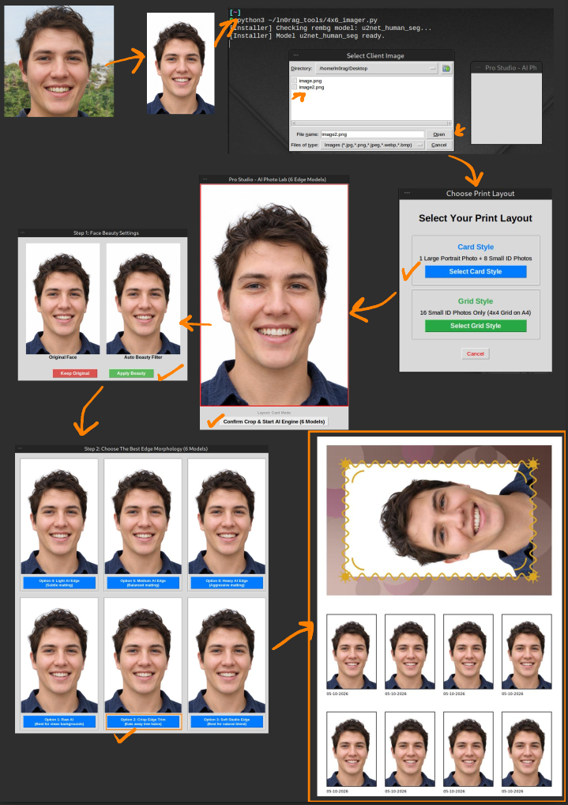

# 4x6-imager

A desktop tool that turns one portrait photo into a print-ready **A4 PDF** of 4x6 cm (40x60 mm) ID photos. It crops the face, optionally smooths the skin, removes the background with AI, and lays everything out for printing at 300 DPI.



## What it does

* Opens a simple GUI: pick an image, choose a layout, drag to crop.
* Locks the crop box to the **40:60** ratio, so the photo is never stretched.
* Optional **beauty filter** with a side-by-side preview (keep the original or apply it).
* Removes the background with `rembg` (`u2net_human_seg` model) and shows **6 edge variations** to choose from.
* Puts each photo on a white background with a thin border and today's date underneath.
* Exports a 300 DPI A4 PDF next to the original image.
* Installs its own Python dependencies on first run.

## Layouts

| Layout | Contents | Output file |
|--------|----------|-------------|
| **Card Style** | 1 large portrait (120x180 mm, rotated to landscape) with a colored background and a gold wavy border, plus 8 small 40x60 mm photos (2x4) | `Print_Ready_Sheet_Card.pdf` |
| **Grid Style** | 16 small 40x60 mm photos (4x4) filling the A4 sheet | `Print_Ready_Sheet_Grid16.pdf` |

In Card Style the large portrait's background is generated from the average color of the subject's clothes, so it matches automatically.

## Edge options

After the AI removes the background you pick the edge result that looks best:

| Option | Method | Best for |
|--------|--------|----------|
| 1 | Raw AI cutout | Clean, plain backgrounds |
| 2 | Crisp edge trim (mask eroded) | Removing halos (e.g. trees behind the subject) |
| 3 | Soft studio edge (eroded + blurred mask) | Natural blending |
| 4 | Light alpha matting | Subtle edge refinement |
| 5 | Medium alpha matting | Balanced |
| 6 | Heavy alpha matting | Hair and difficult edges |

## Requirements

* Linux (Debian/Ubuntu-based, since `tkinter` is installed with `apt`)
* Python 3
* A desktop session (the tool uses a GUI window)
* Internet connection on first run (packages and the AI model are downloaded)
* `sudo` access, only if `python3-tk` is missing

Python packages, installed automatically if missing:

* `Pillow`
* `rembg[cpu]`
* `opencv-python`
* `numpy`

## Installation

Run:

```bash
git clone https://github.com/USERNAME/4x6-imager.git && \
cd 4x6-imager && \
python3 4x6_imager.py
```

On first launch the script installs the missing packages, downloads the `u2net_human_seg` model (a few hundred MB at most, cached afterwards), and restarts itself.

## Usage

1. Run `python3 4x6_imager.py`.
2. Select the client image (`jpg`, `png`, `jpeg`, `webp`, `bmp`).
3. Choose **Card Style** or **Grid Style**.
4. Drag on the image to select the crop area (the ratio is fixed).
5. Click **Confirm Crop & Start AI Engine**.
6. Pick **Keep Original** or **Apply Beauty**.
7. Pick the best of the 6 edge options.
8. The PDF is saved in the same folder as the original image.

## Output details

| Item | Value |
|------|-------|
| Sheet size | A4 (210x297 mm) |
| Resolution | 300 DPI |
| Small photo size | 40x60 mm, white background, thin black border |
| Date label | `DD-MM-YYYY` under each small photo |

## Notes

* Package installation uses `pip --break-system-packages`. If you prefer isolation, run the script inside a virtual environment.
* Background removal runs on CPU, so it takes a few seconds per option.
* Everything runs locally. No image is uploaded anywhere.
* Print at 100% scale (no "fit to page") to keep the real 40x60 mm size.
